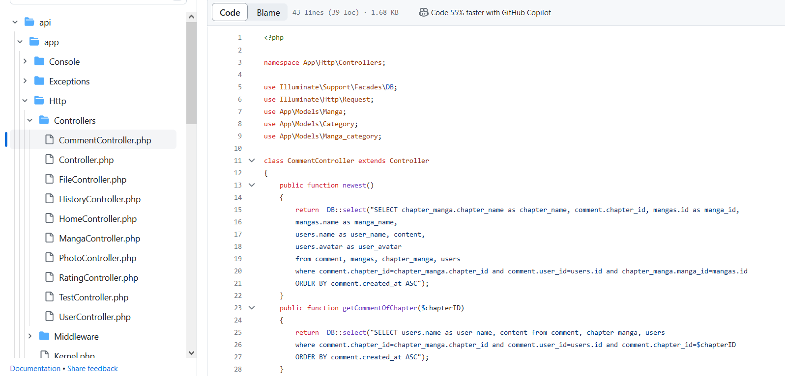
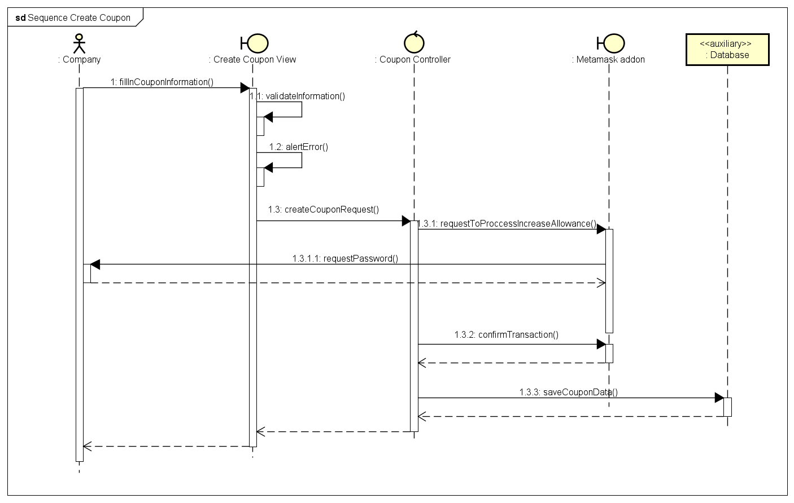

# レベル

- 開始レベル: 基本的なセットアップとプロジェクト構造を理解する

- 中級レベル：自分でプロジェクトを一から作ることができる

- プロレベル: 深い構造を理解し、複雑なプロジェクトを作成できる

# IT スキル

## Javascript(最もよく使う言語)

### ReactJS (プロレベル)

  

- Framer amation: アニメーション
- i18next: 翻訳
- Antd: コンポーネント
- SASS, Fontawesome: CSS
- Axios: リクエストを処理する
- Firebase: NoSQLデータベース、デプロイ

### NestJS-TypeScript (中級レベル)

  

- Firebaseデータベースに接続する
- リクエストを処理する(REST API)
- スマートコントラクトで取引を行う

## Python (中級レベル)

### BeatifulSoup

  

- Webからデータを取得してデータベースに保存する

## Java (中級レベル)

### JavaFX (中級レベル)

  

- Windowsでアプリケーションを構築する
- オブジェクト指向プログラミング

### Android (中級レベル)

  

- Firebase（リアルタイムデータベース）に接続する

### Spring (開始レベル)

  

- Mysqlに接続する
- 簡単なリクエストを処理する

## PHP (中級レベル)

### Laravel

  

- Mysql(xampp)に接続する
- 認証、データベースのクエリ

## Docker (開始レベル)

- コンテナを作成してクラウドにDeployできます（ほとんど常にGoogleクラウドからの自動デプロイを使用しています）

## SQL, NoSQL (中級レベル)

- SQL および nosql でクエリを作成できる

## Cypress (中級レベル)

- Cypressで自動テストを作成できる

## AWS (開始レベル)

### EC2 (開始レベル)

- Ec2でサーバーを作成
- Pm2 と Nginx を使用して Docker コンテナをデプロイする

### App Runner (中級レベル)

- Github 経由でアプリをデプロイする

# ドキュメントを設定する

## システム設計ドキュメントを作成する (中級レベル)

- 画面デザインする
  

- グループ内で仕事を分担する
  

- ダイアグラムを描く
  
